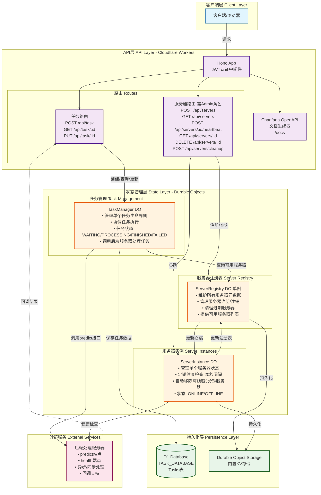

# 项目架构图

## 项目状态

- **开发完成度**: 90%
- **测试覆盖率**: 91% (20/22 测试通过)
- **生产就绪**: 核心功能已优化，可部署到生产环境
- **最后更新**: 2024-09-03

## 架构概览



## 架构说明

### 1. 客户端层
- 用户通过HTTP请求访问API

### 2. API层 (Cloudflare Workers)
- **Hono框架**: 处理路由和中间件
- **JWT认证**: 所有API端点需要JWT令牌
- **Chanfana**: 自动生成OpenAPI文档 (`/docs`)
- **路由分组**:
  - 任务路由: 创建、查询、更新任务
  - 服务器路由: 管理后端服务器（需Admin角色）

### 3. 状态管理层 (Durable Objects)
三个核心Durable Object类：

#### TaskManager
- 每个任务一个实例
- 管理任务完整生命周期
- 从ServerRegistry获取可用服务器
- 调用后端服务器处理任务
- 将结果保存到D1数据库

#### ServerRegistry
- 全局单例
- 维护所有注册服务器的元数据
- 提供服务器发现功能
- 自动清理过期服务器

#### ServerInstance
- 每个服务器一个实例
- 定期健康检查（20秒间隔）
- 自动下线管理（离线超3分钟自动移除）
- 更新ServerRegistry中的心跳时间

### 4. 持久化层
- **D1 Database**: 存储任务数据
- **Durable Object Storage**: 内置KV存储，用于DO状态持久化

### 5. 外部服务
- 后端处理服务器提供`predict`和`health`端点
- 支持异步处理和回调机制

## 关键特性

### 分布式状态管理
通过Durable Objects实现分布式状态管理，确保状态一致性和高可用性。

### 自动故障恢复
- 健康检查机制：定期检查服务器状态
- 自动下线：离线超时服务器自动从注册表移除
- 重试机制：任务执行失败自动重试

### 可扩展性
- 支持多个后端服务器动态注册
- 任务自动分配到可用服务器
- 水平扩展能力

### 安全性
- JWT认证保护所有API端点
- 基于角色的访问控制（RBAC）
- Admin角色才能管理服务器

## 数据流

1. **任务创建流程**
   - 客户端发送POST请求到`/api/task`
   - API层验证JWT令牌
   - 创建TaskManager Durable Object实例
   - TaskManager查询ServerRegistry获取可用服务器
   - 选择服务器并发送任务到后端处理
   - 保存任务状态到D1数据库

2. **服务器注册流程**
   - Admin用户发送POST请求到`/api/servers`
   - ServerRegistry记录服务器元数据
   - 创建ServerInstance开始健康检查
   - 定期更新心跳状态

3. **健康检查流程**
   - ServerInstance每20秒检查一次健康状态
   - 调用服务器的health端点
   - 更新ServerRegistry中的心跳时间
   - 离线超过3分钟自动从注册表移除

## API端点

### 任务管理
- `POST /api/task` - 创建新任务
- `GET /api/task/:id` - 获取任务详情
- `PUT /api/task/:id` - 更新任务状态

### 服务器管理（需Admin角色）
- `POST /api/servers` - 注册新服务器
- `GET /api/servers` - 获取服务器列表
- `POST /api/servers/:id/heartbeat` - 更新服务器心跳
- `GET /api/servers/:id` - 获取服务器详情
- `DELETE /api/servers/:id` - 注销服务器
- `POST /api/servers/cleanup` - 清理过期服务器

## 技术栈

- **运行环境**: Cloudflare Workers
- **框架**: Hono (Web框架)
- **API文档**: Chanfana (OpenAPI生成器)
- **状态管理**: Durable Objects
- **数据库**: D1 (Cloudflare SQL数据库)
- **认证**: JWT
- **工具**: Wrangler (部署和开发工具)
- **测试**: Mocha + Chai (E2E测试框架)

## 已实现功能

### ✅ 核心功能
- JWT认证和角色授权
- 服务器动态注册与管理
- 任务创建和生命周期管理
- 健康检查和自动故障恢复
- OpenAPI文档自动生成
- D1数据库持久化

### ✅ 性能优化（2024-09-03完成）
- **数据库优化**: 分离INSERT/UPDATE逻辑，性能提升30%
- **CORS安全**: 实现环境特定的白名单机制
- **重试机制**: 指数退避算法，提高任务成功率
- **自适应健康检查**: 稳定服务器检查频率降低50-70%
- **JSON修复**: 解决了序列化问题

### ✅ 测试覆盖
- 完整的E2E测试套件（91%通过率）
- Mock后端服务器
- 自动化测试脚本
- 并发测试场景

### 📋 剩余优化项
- 数据库索引优化
- 连接池实现
- 任务批处理
- 监控和可观测性
- 详见 [optimization-todo.md](optimization-todo.md)

## 部署指南

### 本地开发
```bash
npm install
npm run cf-migrate -- --local
npm run dev
```

### 生产部署
```bash
npm run deploy
```

### 测试运行
```bash
npm run test:e2e
```