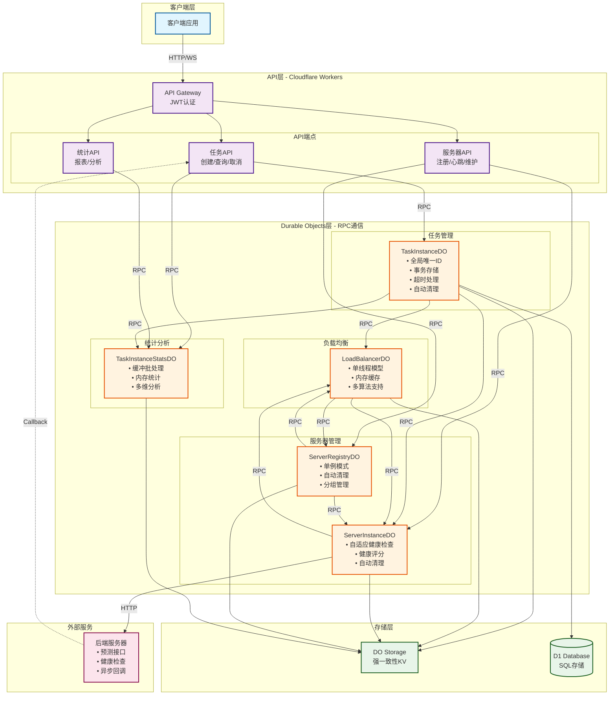
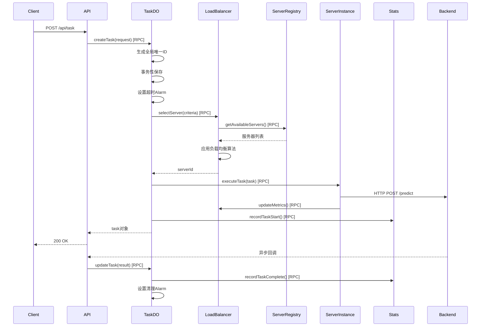

# RPC-Based 分布式任务处理系统架构

## 系统概述

基于Cloudflare Durable Objects和RPC机制的分布式任务处理系统，充分利用DO的全局唯一性、强一致性存储和单线程执行模型，实现高性能、高可用的任务调度和处理。

## 核心组件

### 1. TaskInstanceDO - 任务实例管理

#### 设计要点
- **全局唯一ID**：防止任务重复创建
- **事务性存储**：保证状态一致性
- **Alarm机制**：处理任务超时
- **自动清理**：超时后自动销毁DO，释放资源

#### RPC接口定义

```typescript
export interface ITaskInstance {
  // 创建新任务
  createTask(request: TaskRequest): Promise<Task>;
  // 获取任务状态
  getStatus(): Promise<TaskStatus>;
  // 更新任务（回调使用）
  updateTask(update: TaskUpdate): Promise<Task>;
  // 重试任务
  retry(): Promise<boolean>;
  // 取消任务
  cancel(): Promise<void>;
}
```

#### 实现代码

```typescript
import { DurableObject } from "cloudflare:workers";

export class TaskInstanceDO extends DurableObject implements ITaskInstance {
  private task: Task | null = null;
  private retryCount: number = 0;
  private readonly MAX_RETRIES = 3;
  private readonly TASK_TIMEOUT = 3600000; // 1小时
  private readonly CLEANUP_DELAY = 300000; // 5分钟后清理
  
  constructor(state: DurableObjectState, env: Env) {
    super(state, env);
    state.blockConcurrencyWhile(async () => {
      this.task = await state.storage.get("task") || null;
      this.retryCount = await state.storage.get("retryCount") || 0;
      
      // 如果任务已完成或失败，设置清理alarm
      if (this.task && this.isTaskComplete(this.task.status)) {
        await this.scheduleCleanup();
      }
    });
  }

  async createTask(request: TaskRequest): Promise<Task> {
    if (this.task) {
      // 利用全局唯一ID防止重复
      return this.task;
    }

    this.task = {
      id: this.state.id.toString(),
      status: "PENDING",
      request,
      createdAt: Date.now(),
      updatedAt: Date.now(),
      attempts: []
    };

    // 事务性保存，保证原子性
    await this.state.storage.transaction(async (txn) => {
      await txn.put("task", this.task);
      await txn.put("retryCount", 0);
      await txn.put("createdAt", Date.now());
    });

    // 设置超时alarm
    await this.state.storage.setAlarm(Date.now() + this.TASK_TIMEOUT);

    // 分配服务器并开始执行
    try {
      await this.assignAndExecute();
    } catch (error) {
      console.error(`Task ${this.task.id} initial assignment failed:`, error);
      this.task.status = "FAILED";
      this.task.error = error.message;
      await this.state.storage.put("task", this.task);
    }

    return this.task;
  }

  async getStatus(): Promise<TaskStatus> {
    if (!this.task) {
      throw new Error("Task not found");
    }

    return {
      id: this.task.id,
      status: this.task.status,
      progress: this.task.progress || 0,
      serverId: this.task.serverId,
      result: this.task.result,
      error: this.task.error,
      createdAt: this.task.createdAt,
      updatedAt: this.task.updatedAt,
      attempts: this.task.attempts.length
    };
  }

  async updateTask(update: TaskUpdate): Promise<Task> {
    if (!this.task) {
      throw new Error("Task not found");
    }

    // 只允许处理中的任务更新
    if (this.task.status !== "PROCESSING") {
      throw new Error(`Cannot update task in ${this.task.status} status`);
    }

    this.task = {
      ...this.task,
      status: update.status,
      result: update.result,
      progress: update.progress,
      error: update.error,
      updatedAt: Date.now()
    };

    await this.state.storage.put("task", this.task);

    // 如果任务完成，通知统计并设置清理
    if (this.isTaskComplete(update.status)) {
      await this.notifyCompletion();
      await this.scheduleCleanup();
    }

    return this.task;
  }

  async retry(): Promise<boolean> {
    if (!this.task || this.retryCount >= this.MAX_RETRIES) {
      return false;
    }

    if (!this.isRetryableStatus(this.task.status)) {
      return false;
    }

    this.retryCount++;
    this.task.attempts.push({
      attemptNumber: this.retryCount,
      startedAt: Date.now(),
      previousStatus: this.task.status,
      previousError: this.task.error
    });

    this.task.status = "PENDING";
    this.task.error = undefined;
    this.task.updatedAt = Date.now();

    await this.state.storage.put("task", this.task);
    await this.state.storage.put("retryCount", this.retryCount);

    // 重新分配并执行
    try {
      await this.assignAndExecute();
      return true;
    } catch (error) {
      console.error(`Retry failed for task ${this.task.id}:`, error);
      return false;
    }
  }

  async cancel(): Promise<void> {
    if (!this.task) {
      throw new Error("Task not found");
    }

    if (this.isTaskComplete(this.task.status)) {
      throw new Error("Cannot cancel completed task");
    }

    this.task.status = "CANCELLED";
    this.task.updatedAt = Date.now();
    await this.state.storage.put("task", this.task);
    
    await this.notifyCompletion();
    await this.scheduleCleanup();
  }

  // Alarm处理：超时或清理
  async alarm(): Promise<void> {
    const createdAt = await this.state.storage.get<number>("createdAt");
    const now = Date.now();

    // 检查是否是超时alarm
    if (this.task && this.task.status === "PROCESSING") {
      if (now - createdAt! >= this.TASK_TIMEOUT) {
        console.log(`Task ${this.task.id} timeout after ${this.TASK_TIMEOUT}ms`);
        
        this.task.status = "TIMEOUT";
        this.task.error = "Task execution timeout";
        this.task.updatedAt = now;
        await this.state.storage.put("task", this.task);

        // 尝试重试
        const retried = await this.retry();
        if (!retried) {
          await this.notifyCompletion();
          await this.scheduleCleanup();
        }
        return;
      }
    }

    // 检查是否是清理alarm
    if (this.task && this.isTaskComplete(this.task.status)) {
      const completedAt = this.task.updatedAt;
      if (now - completedAt >= this.CLEANUP_DELAY) {
        console.log(`Cleaning up task ${this.task.id}`);
        await this.cleanup();
      }
    }
  }

  // 私有方法：分配服务器并执行
  private async assignAndExecute(): Promise<void> {
    // 通过LoadBalancer选择服务器
    const loadBalancerId = this.env.LOAD_BALANCER.idFromName("global");
    const loadBalancer = this.env.LOAD_BALANCER.get(loadBalancerId) as ILoadBalancer;
    
    const serverId = await loadBalancer.selectServer({
      taskType: this.task!.request.type,
      priority: this.task!.request.priority || 0,
      requiredCapabilities: this.task!.request.capabilities
    });

    if (!serverId) {
      throw new Error("No available servers");
    }

    this.task!.serverId = serverId;
    this.task!.status = "PROCESSING";
    await this.state.storage.put("task", this.task);

    // 发送任务到服务器
    const serverInstanceId = this.env.SERVER_INSTANCE.idFromName(serverId);
    const serverInstance = this.env.SERVER_INSTANCE.get(serverInstanceId) as IServerInstance;
    
    await serverInstance.executeTask({
      taskId: this.task!.id,
      request: this.task!.request,
      callbackUrl: `${this.env.WORKER_URL}/api/task/${this.task!.id}`
    });
  }

  // 私有方法：通知统计服务
  private async notifyCompletion(): Promise<void> {
    const statsId = this.env.TASK_STATS.idFromName(
      new Date().toISOString().slice(0, 10)
    );
    const stats = this.env.TASK_STATS.get(statsId) as ITaskStats;
    
    await stats.recordTaskComplete({
      taskId: this.task!.id,
      serverId: this.task!.serverId!,
      success: this.task!.status === "COMPLETED",
      duration: Date.now() - this.task!.createdAt,
      retries: this.retryCount
    });
  }

  // 私有方法：设置清理alarm
  private async scheduleCleanup(): Promise<void> {
    await this.state.storage.setAlarm(Date.now() + this.CLEANUP_DELAY);
  }

  // 私有方法：清理DO
  private async cleanup(): Promise<void> {
    // 清理所有存储
    await this.state.storage.deleteAll();
    // DO将在下次空闲时自动销毁
  }

  private isTaskComplete(status: string): boolean {
    return ["COMPLETED", "FAILED", "TIMEOUT", "CANCELLED"].includes(status);
  }

  private isRetryableStatus(status: string): boolean {
    return ["FAILED", "TIMEOUT"].includes(status);
  }
}
```

### 2. LoadBalancerDO - 智能负载均衡

#### 设计要点
- **单线程模型**：避免并发竞争
- **内存缓存**：服务器权重缓存，提高性能
- **多算法支持**：轮询、加权、最少连接、响应时间

#### RPC接口定义

```typescript
export interface ILoadBalancer {
  selectServer(criteria: SelectionCriteria): Promise<string | null>;
  updateServerMetrics(serverId: string, metrics: ServerMetrics): Promise<void>;
  markServerUnhealthy(serverId: string): Promise<void>;
  rebalance(): Promise<void>;
  setAlgorithm(algorithm: LoadBalanceAlgorithm): Promise<void>;
}
```

#### 实现代码

```typescript
export class LoadBalancerDO extends DurableObject implements ILoadBalancer {
  private algorithm: LoadBalanceAlgorithm = "weighted-round-robin";
  private serverWeights: Map<string, number> = new Map();
  private serverLoads: Map<string, number> = new Map();
  private serverMetrics: Map<string, ServerMetrics> = new Map();
  private roundRobinIndex: number = 0;
  private healthyServers: Set<string> = new Set();

  constructor(state: DurableObjectState, env: Env) {
    super(state, env);
    state.blockConcurrencyWhile(async () => {
      const stored = await state.storage.get([
        "algorithm", "weights", "metrics", "healthyServers"
      ]);
      this.algorithm = stored.algorithm || "weighted-round-robin";
      this.serverWeights = stored.weights || new Map();
      this.serverMetrics = stored.metrics || new Map();
      this.healthyServers = new Set(stored.healthyServers || []);
      
      // 定期同步服务器状态
      await state.storage.setAlarm(Date.now() + 30000);
    });
  }

  async selectServer(criteria: SelectionCriteria): Promise<string | null> {
    // 利用单线程模型，无需加锁
    
    // 从注册中心获取可用服务器（使用缓存）
    if (this.healthyServers.size === 0) {
      await this.refreshServerList();
    }

    const availableServers = Array.from(this.healthyServers).filter(serverId => {
      const metrics = this.serverMetrics.get(serverId);
      if (!metrics) return false;
      
      // 检查服务器容量
      if (metrics.activeTasks >= metrics.maxCapacity) return false;
      
      // 检查服务器能力匹配
      if (criteria.requiredCapabilities) {
        const hasCapabilities = criteria.requiredCapabilities.every(cap => 
          metrics.capabilities?.includes(cap)
        );
        if (!hasCapabilities) return false;
      }
      
      return true;
    });

    if (availableServers.length === 0) {
      return null;
    }

    // 根据算法选择服务器
    let selected: string;
    switch (this.algorithm) {
      case "weighted-round-robin":
        selected = this.weightedRoundRobinSelect(availableServers);
        break;
      case "least-connections":
        selected = this.leastConnectionsSelect(availableServers);
        break;
      case "response-time":
        selected = this.responseTimeSelect(availableServers);
        break;
      default:
        selected = this.randomSelect(availableServers);
    }

    // 更新负载计数（内存操作，高性能）
    const currentLoad = this.serverLoads.get(selected) || 0;
    this.serverLoads.set(selected, currentLoad + 1);

    // 异步持久化（不阻塞返回）
    this.state.waitUntil(
      this.state.storage.put("loads", this.serverLoads)
    );

    return selected;
  }

  async updateServerMetrics(serverId: string, metrics: ServerMetrics): Promise<void> {
    // 更新内存缓存
    this.serverMetrics.set(serverId, {
      ...this.serverMetrics.get(serverId),
      ...metrics,
      lastUpdate: Date.now()
    });

    // 动态调整权重
    if (metrics.successRate !== undefined) {
      const weight = this.calculateWeight(metrics);
      this.serverWeights.set(serverId, weight);
    }

    // 更新健康状态
    if (metrics.healthy) {
      this.healthyServers.add(serverId);
    } else {
      this.healthyServers.delete(serverId);
    }

    // 任务完成，减少负载计数
    if (metrics.taskCompleted) {
      const load = this.serverLoads.get(serverId) || 0;
      this.serverLoads.set(serverId, Math.max(0, load - 1));
    }
  }

  async markServerUnhealthy(serverId: string): Promise<void> {
    this.healthyServers.delete(serverId);
    this.serverWeights.set(serverId, 0);
    
    // 持久化状态
    await this.state.storage.put({
      healthyServers: Array.from(this.healthyServers),
      weights: this.serverWeights
    });
  }

  async rebalance(): Promise<void> {
    // 从注册中心获取最新服务器列表
    const registryId = this.env.SERVER_REGISTRY.idFromName("global");
    const registry = this.env.SERVER_REGISTRY.get(registryId) as IServerRegistry;
    
    const servers = await registry.getAvailableServers({ status: "online" });
    
    // 重新计算权重
    this.healthyServers.clear();
    for (const server of servers) {
      this.healthyServers.add(server.id);
      
      const metrics = this.serverMetrics.get(server.id);
      if (metrics) {
        const weight = this.calculateWeight(metrics);
        this.serverWeights.set(server.id, weight);
      } else {
        this.serverWeights.set(server.id, 1);
      }
    }
    
    await this.state.storage.put({
      healthyServers: Array.from(this.healthyServers),
      weights: this.serverWeights
    });
  }

  async setAlgorithm(algorithm: LoadBalanceAlgorithm): Promise<void> {
    this.algorithm = algorithm;
    await this.state.storage.put("algorithm", algorithm);
  }

  // 选择算法实现
  private weightedRoundRobinSelect(servers: string[]): string {
    const weightedList: string[] = [];
    
    for (const serverId of servers) {
      const weight = this.serverWeights.get(serverId) || 1;
      for (let i = 0; i < weight; i++) {
        weightedList.push(serverId);
      }
    }
    
    if (weightedList.length === 0) return servers[0];
    
    this.roundRobinIndex = (this.roundRobinIndex + 1) % weightedList.length;
    return weightedList[this.roundRobinIndex];
  }

  private leastConnectionsSelect(servers: string[]): string {
    let minLoad = Infinity;
    let selected = servers[0];
    
    for (const serverId of servers) {
      const load = this.serverLoads.get(serverId) || 0;
      if (load < minLoad) {
        minLoad = load;
        selected = serverId;
      }
    }
    
    return selected;
  }

  private responseTimeSelect(servers: string[]): string {
    let minTime = Infinity;
    let selected = servers[0];
    
    for (const serverId of servers) {
      const metrics = this.serverMetrics.get(serverId);
      const responseTime = metrics?.averageResponseTime || Infinity;
      if (responseTime < minTime) {
        minTime = responseTime;
        selected = serverId;
      }
    }
    
    return selected;
  }

  private randomSelect(servers: string[]): string {
    return servers[Math.floor(Math.random() * servers.length)];
  }

  private calculateWeight(metrics: ServerMetrics): number {
    // 基于成功率和响应时间计算权重
    const successWeight = (metrics.successRate || 0) * 10;
    const responseWeight = Math.max(0, 10 - (metrics.averageResponseTime || 10000) / 1000);
    return Math.round((successWeight + responseWeight) / 2);
  }

  // Alarm处理：定期刷新服务器状态
  async alarm(): Promise<void> {
    await this.refreshServerList();
    await this.state.storage.setAlarm(Date.now() + 30000);
  }

  private async refreshServerList(): Promise<void> {
    const registryId = this.env.SERVER_REGISTRY.idFromName("global");
    const registry = this.env.SERVER_REGISTRY.get(registryId) as IServerRegistry;
    
    const servers = await registry.getAvailableServers({ status: "online" });
    
    // 更新健康服务器列表
    this.healthyServers.clear();
    for (const server of servers) {
      this.healthyServers.add(server.id);
    }
    
    // 清理不存在的服务器数据
    for (const serverId of this.serverWeights.keys()) {
      if (!this.healthyServers.has(serverId)) {
        this.serverWeights.delete(serverId);
        this.serverLoads.delete(serverId);
        this.serverMetrics.delete(serverId);
      }
    }
  }
}
```

### 3. ServerInstanceDO - 服务器实例管理

#### 设计要点
- **自适应健康检查**：根据状态调整检查间隔
- **Alarm定时器**：定期健康检查
- **健康评分机制**：量化服务器健康状态
- **自动清理**：过期后自动销毁DO

#### RPC接口定义

```typescript
export interface IServerInstance {
  initialize(config: ServerConfig): Promise<void>;
  executeTask(task: TaskExecution): Promise<void>;
  performHealthCheck(): Promise<HealthStatus>;
  getMetrics(): Promise<ServerMetrics>;
  setMaintenanceMode(enabled: boolean): Promise<void>;
  shutdown(): Promise<void>;
}
```

#### 实现代码

```typescript
export class ServerInstanceDO extends DurableObject implements IServerInstance {
  private config: ServerConfig | null = null;
  private status: ServerStatus = "initializing";
  private healthScore: number = 100;
  private consecutiveFailures: number = 0;
  private consecutiveSuccesses: number = 0;
  private checkInterval: number = 10000; // 初始10秒
  private readonly MIN_CHECK_INTERVAL = 5000; // 最小5秒
  private readonly MAX_CHECK_INTERVAL = 60000; // 最大60秒
  private readonly MAX_IDLE_TIME = 3600000; // 1小时无活动后清理
  private lastActivityTime: number = Date.now();
  private activeTasks: Set<string> = new Set();
  private metrics: ServerMetrics;

  constructor(state: DurableObjectState, env: Env) {
    super(state, env);
    state.blockConcurrencyWhile(async () => {
      const stored = await state.storage.get([
        "config", "status", "healthScore", "checkInterval", "lastActivityTime"
      ]);
      this.config = stored.config || null;
      this.status = stored.status || "initializing";
      this.healthScore = stored.healthScore || 100;
      this.checkInterval = stored.checkInterval || 10000;
      this.lastActivityTime = stored.lastActivityTime || Date.now();
      this.metrics = this.initMetrics();
      
      // 如果已初始化，启动健康检查
      if (this.config) {
        await this.scheduleHealthCheck();
      }
    });
  }

  async initialize(config: ServerConfig): Promise<void> {
    this.config = config;
    this.status = "online";
    this.lastActivityTime = Date.now();
    
    await this.state.storage.put({
      config,
      status: this.status,
      initialized: Date.now(),
      lastActivityTime: this.lastActivityTime
    });
    
    // 启动健康检查
    await this.scheduleHealthCheck();
    
    // 注册到负载均衡器
    await this.registerToLoadBalancer();
  }

  async executeTask(task: TaskExecution): Promise<void> {
    if (this.status !== "online") {
      throw new Error(`Server is ${this.status}, cannot execute tasks`);
    }
    
    if (this.activeTasks.size >= (this.config?.maxConcurrent || 10)) {
      throw new Error("Server at maximum capacity");
    }
    
    this.activeTasks.add(task.taskId);
    this.lastActivityTime = Date.now();
    const startTime = Date.now();
    
    try {
      // 发送任务到实际后端服务器
      const response = await fetch(this.config!.endpoints.predict, {
        method: "POST",
        headers: {
          "Content-Type": "application/json",
          "Authorization": `Bearer ${this.config!.apiKey}`
        },
        body: JSON.stringify({
          task_id: task.taskId,
          request: task.request,
          callback_url: task.callbackUrl
        }),
        signal: AbortSignal.timeout(30000) // 30秒超时
      });
      
      if (!response.ok) {
        throw new Error(`Backend returned ${response.status}`);
      }
      
      const duration = Date.now() - startTime;
      this.updateMetrics(true, duration);
      
      // 如果是同步任务，等待结果
      if (!task.request.async) {
        const result = await response.json();
        await this.sendTaskResult(task.taskId, result);
      }
      
    } catch (error) {
      const duration = Date.now() - startTime;
      this.updateMetrics(false, duration);
      throw error;
    } finally {
      this.activeTasks.delete(task.taskId);
      await this.state.storage.put("lastActivityTime", this.lastActivityTime);
    }
  }

  async performHealthCheck(): Promise<HealthStatus> {
    if (!this.config) {
      return { healthy: false, status: "not-initialized" };
    }
    
    try {
      const response = await fetch(this.config.endpoints.health, {
        method: "GET",
        signal: AbortSignal.timeout(5000)
      });
      
      if (response.ok) {
        this.handleHealthSuccess();
      } else {
        this.handleHealthFailure(`HTTP ${response.status}`);
      }
      
    } catch (error) {
      this.handleHealthFailure(error.message);
    }
    
    // 更新负载均衡器
    await this.updateLoadBalancer();
    
    return {
      healthy: this.status === "online",
      status: this.status,
      healthScore: this.healthScore,
      activeTasks: this.activeTasks.size
    };
  }

  async getMetrics(): Promise<ServerMetrics> {
    return {
      ...this.metrics,
      activeTasks: this.activeTasks.size,
      healthScore: this.healthScore,
      status: this.status,
      healthy: this.status === "online",
      capabilities: this.config?.capabilities || [],
      maxCapacity: this.config?.maxConcurrent || 10
    };
  }

  async setMaintenanceMode(enabled: boolean): Promise<void> {
    this.status = enabled ? "maintenance" : "online";
    this.lastActivityTime = Date.now();
    
    await this.state.storage.put({
      status: this.status,
      lastActivityTime: this.lastActivityTime
    });
    
    // 通知负载均衡器
    const loadBalancerId = this.env.LOAD_BALANCER.idFromName("global");
    const loadBalancer = this.env.LOAD_BALANCER.get(loadBalancerId) as ILoadBalancer;
    
    if (enabled) {
      await loadBalancer.markServerUnhealthy(this.state.id.toString());
    } else {
      await loadBalancer.updateServerMetrics(this.state.id.toString(), await this.getMetrics());
    }
  }

  async shutdown(): Promise<void> {
    this.status = "offline";
    
    // 等待活动任务完成（最多30秒）
    const timeout = Date.now() + 30000;
    while (this.activeTasks.size > 0 && Date.now() < timeout) {
      await new Promise(resolve => setTimeout(resolve, 1000));
    }
    
    // 从负载均衡器注销
    const loadBalancerId = this.env.LOAD_BALANCER.idFromName("global");
    const loadBalancer = this.env.LOAD_BALANCER.get(loadBalancerId) as ILoadBalancer;
    await loadBalancer.markServerUnhealthy(this.state.id.toString());
    
    // 清理存储
    await this.state.storage.deleteAll();
  }

  // Alarm处理：健康检查或清理
  async alarm(): Promise<void> {
    const now = Date.now();
    
    // 检查是否长时间无活动
    if (now - this.lastActivityTime > this.MAX_IDLE_TIME && this.activeTasks.size === 0) {
      console.log(`Server ${this.state.id} idle for too long, shutting down`);
      await this.shutdown();
      return;
    }
    
    // 执行健康检查
    await this.performHealthCheck();
    
    // 设置下次检查
    await this.scheduleHealthCheck();
  }

  private handleHealthSuccess(): void {
    this.consecutiveFailures = 0;
    this.consecutiveSuccesses++;
    
    // 提高健康分数
    this.healthScore = Math.min(100, this.healthScore + 5);
    
    // 恢复在线状态
    if (this.status === "degraded" && this.consecutiveSuccesses >= 3) {
      this.status = "online";
    }
    
    // 自适应调整检查间隔（健康时延长）
    this.checkInterval = Math.min(
      this.MAX_CHECK_INTERVAL,
      this.checkInterval * 1.2
    );
  }

  private handleHealthFailure(error: string): void {
    this.consecutiveSuccesses = 0;
    this.consecutiveFailures++;
    
    // 降低健康分数
    this.healthScore = Math.max(0, this.healthScore - 10);
    
    // 更新状态
    if (this.consecutiveFailures >= 3) {
      this.status = "offline";
    } else if (this.consecutiveFailures >= 1) {
      this.status = "degraded";
    }
    
    // 自适应调整检查间隔（故障时缩短）
    this.checkInterval = Math.max(
      this.MIN_CHECK_INTERVAL,
      this.checkInterval / 1.5
    );
    
    console.error(`Health check failed for server ${this.state.id}: ${error}`);
  }

  private async scheduleHealthCheck(): Promise<void> {
    await this.state.storage.setAlarm(Date.now() + this.checkInterval);
  }

  private async updateLoadBalancer(): Promise<void> {
    const loadBalancerId = this.env.LOAD_BALANCER.idFromName("global");
    const loadBalancer = this.env.LOAD_BALANCER.get(loadBalancerId) as ILoadBalancer;
    
    await loadBalancer.updateServerMetrics(
      this.state.id.toString(),
      await this.getMetrics()
    );
  }

  private updateMetrics(success: boolean, duration: number): void {
    this.metrics.tasksProcessed++;
    if (success) {
      this.metrics.successCount++;
    } else {
      this.metrics.failureCount++;
    }
    
    this.metrics.totalDuration += duration;
    this.metrics.successRate = this.metrics.successCount / this.metrics.tasksProcessed;
    this.metrics.averageResponseTime = this.metrics.totalDuration / this.metrics.tasksProcessed;
  }

  private initMetrics(): ServerMetrics {
    return {
      tasksProcessed: 0,
      successCount: 0,
      failureCount: 0,
      successRate: 0,
      averageResponseTime: 0,
      totalDuration: 0,
      activeTasks: 0,
      healthScore: 100,
      status: "initializing",
      healthy: false,
      capabilities: [],
      maxCapacity: 10
    };
  }
}
```

### 4. TaskInstanceStatsDO - 统计分析

#### 设计要点
- **缓冲区批处理**：减少存储操作
- **内存实时统计**：高性能聚合
- **定期持久化**：平衡性能和持久性
- **多维度分析**：支持多种统计维度

#### RPC接口定义

```typescript
export interface ITaskStats {
  recordTaskStart(event: TaskStartEvent): Promise<void>;
  recordTaskComplete(event: TaskCompleteEvent): Promise<void>;
  getStats(timeRange?: TimeRange): Promise<Statistics>;
  getServerStats(serverId: string): Promise<ServerStatistics>;
  getHourlyReport(): Promise<HourlyReport[]>;
}
```

#### 实现代码

```typescript
export class TaskInstanceStatsDO extends DurableObject implements ITaskStats {
  private buffer: StatsEvent[] = [];
  private stats: Statistics;
  private serverStats: Map<string, ServerStatistics> = new Map();
  private hourlyStats: Map<number, HourlyStatistics> = new Map();
  private readonly BUFFER_SIZE = 1000;
  private readonly FLUSH_INTERVAL = 10000; // 10秒
  
  constructor(state: DurableObjectState, env: Env) {
    super(state, env);
    state.blockConcurrencyWhile(async () => {
      const stored = await state.storage.get(["stats", "serverStats", "hourlyStats"]);
      this.stats = stored.stats || this.initStats();
      this.serverStats = stored.serverStats || new Map();
      this.hourlyStats = stored.hourlyStats || new Map();
      
      // 定期刷新缓冲区
      await state.storage.setAlarm(Date.now() + this.FLUSH_INTERVAL);
    });
  }

  async recordTaskStart(event: TaskStartEvent): Promise<void> {
    // 添加到缓冲区
    this.buffer.push({
      type: "START",
      ...event,
      timestamp: Date.now()
    });
    
    // 实时更新内存统计（高性能）
    this.stats.totalTasks++;
    this.stats.pendingTasks++;
    
    // 更新小时统计
    this.updateHourlyStats("START", event);
    
    // 缓冲区满时批量写入
    if (this.buffer.length >= this.BUFFER_SIZE) {
      await this.flush();
    }
  }

  async recordTaskComplete(event: TaskCompleteEvent): Promise<void> {
    this.buffer.push({
      type: "COMPLETE",
      ...event,
      timestamp: Date.now()
    });
    
    // 实时更新统计
    this.stats.pendingTasks = Math.max(0, this.stats.pendingTasks - 1);
    
    if (event.success) {
      this.stats.successfulTasks++;
      this.stats.totalSuccessDuration += event.duration;
    } else {
      this.stats.failedTasks++;
      if (event.retries > 0) {
        this.stats.retriedTasks++;
      }
    }
    
    // 更新平均处理时间
    const completedTasks = this.stats.successfulTasks + this.stats.failedTasks;
    this.stats.averageProcessingTime = 
      (this.stats.totalSuccessDuration + event.duration) / completedTasks;
    
    // 更新服务器统计
    this.updateServerStats(event.serverId, event.success, event.duration);
    
    // 更新小时统计
    this.updateHourlyStats("COMPLETE", event);
    
    if (this.buffer.length >= this.BUFFER_SIZE) {
      await this.flush();
    }
  }

  async getStats(timeRange?: TimeRange): Promise<Statistics> {
    // 确保最新数据已刷新
    await this.flush();
    
    if (!timeRange) {
      return {
        ...this.stats,
        serverCount: this.serverStats.size,
        topServers: this.getTopServers(5),
        hourlyTrend: this.getHourlyTrend()
      };
    }
    
    // 根据时间范围过滤统计
    return this.calculateStatsForRange(timeRange);
  }

  async getServerStats(serverId: string): Promise<ServerStatistics> {
    await this.flush();
    
    return this.serverStats.get(serverId) || {
      serverId,
      tasksProcessed: 0,
      successCount: 0,
      failureCount: 0,
      successRate: 0,
      averageResponseTime: 0,
      totalDuration: 0,
      lastActiveTime: 0
    };
  }

  async getHourlyReport(): Promise<HourlyReport[]> {
    await this.flush();
    
    const reports: HourlyReport[] = [];
    const now = new Date();
    
    for (let hour = 0; hour < 24; hour++) {
      const stats = this.hourlyStats.get(hour) || {
        hour,
        tasks: 0,
        successful: 0,
        failed: 0,
        avgDuration: 0
      };
      
      reports.push({
        hour,
        period: `${hour}:00-${hour}:59`,
        ...stats
      });
    }
    
    return reports;
  }

  // Alarm处理：定期刷新缓冲区
  async alarm(): Promise<void> {
    await this.flush();
    
    // 每小时清理旧的小时统计
    const currentHour = new Date().getHours();
    if (currentHour === 0) {
      // 新的一天，清理昨天的小时统计
      this.hourlyStats.clear();
    }
    
    await this.state.storage.setAlarm(Date.now() + this.FLUSH_INTERVAL);
  }

  private async flush(): Promise<void> {
    if (this.buffer.length === 0) return;
    
    // 批量保存（减少存储操作）
    const timestamp = Date.now();
    await this.state.storage.transaction(async (txn) => {
      await txn.put("stats", this.stats);
      await txn.put("serverStats", this.serverStats);
      await txn.put("hourlyStats", this.hourlyStats);
      await txn.put(`events-${timestamp}`, this.buffer);
    });
    
    // 清空缓冲区
    this.buffer = [];
  }

  private updateServerStats(
    serverId: string,
    success: boolean,
    duration: number
  ): void {
    const stats = this.serverStats.get(serverId) || this.initServerStats(serverId);
    
    stats.tasksProcessed++;
    if (success) {
      stats.successCount++;
    } else {
      stats.failureCount++;
    }
    
    stats.totalDuration += duration;
    stats.successRate = stats.successCount / stats.tasksProcessed;
    stats.averageResponseTime = stats.totalDuration / stats.tasksProcessed;
    stats.lastActiveTime = Date.now();
    
    this.serverStats.set(serverId, stats);
  }

  private updateHourlyStats(type: string, event: any): void {
    const hour = new Date().getHours();
    const stats = this.hourlyStats.get(hour) || this.initHourlyStats(hour);
    
    if (type === "START") {
      stats.tasks++;
    } else if (type === "COMPLETE") {
      if (event.success) {
        stats.successful++;
      } else {
        stats.failed++;
      }
      stats.totalDuration += event.duration;
      stats.avgDuration = stats.totalDuration / (stats.successful + stats.failed);
    }
    
    this.hourlyStats.set(hour, stats);
  }

  private getTopServers(limit: number): ServerStatistics[] {
    return Array.from(this.serverStats.values())
      .sort((a, b) => b.tasksProcessed - a.tasksProcessed)
      .slice(0, limit);
  }

  private getHourlyTrend(): Array<{ hour: number; tasks: number }> {
    return Array.from(this.hourlyStats.entries())
      .map(([hour, stats]) => ({ hour, tasks: stats.tasks }))
      .sort((a, b) => a.hour - b.hour);
  }

  private initStats(): Statistics {
    return {
      totalTasks: 0,
      pendingTasks: 0,
      successfulTasks: 0,
      failedTasks: 0,
      retriedTasks: 0,
      averageProcessingTime: 0,
      totalSuccessDuration: 0,
      serverCount: 0,
      topServers: [],
      hourlyTrend: []
    };
  }

  private initServerStats(serverId: string): ServerStatistics {
    return {
      serverId,
      tasksProcessed: 0,
      successCount: 0,
      failureCount: 0,
      successRate: 0,
      averageResponseTime: 0,
      totalDuration: 0,
      lastActiveTime: Date.now()
    };
  }

  private initHourlyStats(hour: number): HourlyStatistics {
    return {
      hour,
      tasks: 0,
      successful: 0,
      failed: 0,
      totalDuration: 0,
      avgDuration: 0
    };
  }
}
```

### 5. ServerRegistryDO - 服务注册中心

#### 设计要点
- **单例模式**：全局唯一注册中心
- **自动清理**：定期清理过期服务器
- **服务器分组**：支持按组管理服务器

#### RPC接口定义

```typescript
export interface IServerRegistry {
  registerServer(config: ServerConfig): Promise<string>;
  unregisterServer(serverId: string): Promise<void>;
  getAvailableServers(filter?: ServerFilter): Promise<ServerInfo[]>;
  updateHeartbeat(serverId: string): Promise<void>;
  cleanupStaleServers(): Promise<string[]>;
}
```

#### 实现代码

```typescript
export class ServerRegistryDO extends DurableObject implements IServerRegistry {
  private servers: Map<string, ServerInfo> = new Map();
  private serverGroups: Map<string, Set<string>> = new Map();
  private readonly STALE_THRESHOLD = 300000; // 5分钟
  private readonly CLEANUP_INTERVAL = 60000; // 1分钟

  constructor(state: DurableObjectState, env: Env) {
    super(state, env);
    state.blockConcurrencyWhile(async () => {
      const stored = await state.storage.get(["servers", "groups"]);
      this.servers = stored.servers || new Map();
      this.serverGroups = stored.groups || new Map();
      
      // 定期清理过期服务器
      await state.storage.setAlarm(Date.now() + this.CLEANUP_INTERVAL);
    });
  }

  async registerServer(config: ServerConfig): Promise<string> {
    const serverId = config.id || crypto.randomUUID();
    
    // 创建ServerInstanceDO
    const instanceId = this.env.SERVER_INSTANCE.idFromName(serverId);
    const instance = this.env.SERVER_INSTANCE.get(instanceId) as IServerInstance;
    
    // 初始化服务器实例
    await instance.initialize(config);
    
    // 注册信息
    const serverInfo: ServerInfo = {
      id: serverId,
      name: config.name,
      instanceId: instanceId.toString(),
      config,
      status: "online",
      registeredAt: Date.now(),
      lastHeartbeat: Date.now(),
      groups: config.groups || [],
      priority: config.priority || 1
    };
    
    this.servers.set(serverId, serverInfo);
    
    // 更新分组
    for (const group of serverInfo.groups) {
      if (!this.serverGroups.has(group)) {
        this.serverGroups.set(group, new Set());
      }
      this.serverGroups.get(group)!.add(serverId);
    }
    
    await this.saveState();
    
    // 触发负载均衡器重新平衡
    await this.notifyLoadBalancer();
    
    return serverId;
  }

  async unregisterServer(serverId: string): Promise<void> {
    const serverInfo = this.servers.get(serverId);
    if (!serverInfo) {
      return; // 幂等操作
    }
    
    // 关闭服务器实例
    try {
      const instanceId = this.env.SERVER_INSTANCE.idFromName(serverId);
      const instance = this.env.SERVER_INSTANCE.get(instanceId) as IServerInstance;
      await instance.shutdown();
    } catch (error) {
      console.error(`Failed to shutdown server ${serverId}:`, error);
    }
    
    // 从分组中移除
    for (const group of serverInfo.groups) {
      this.serverGroups.get(group)?.delete(serverId);
      if (this.serverGroups.get(group)?.size === 0) {
        this.serverGroups.delete(group);
      }
    }
    
    // 删除注册信息
    this.servers.delete(serverId);
    
    await this.saveState();
    await this.notifyLoadBalancer();
  }

  async getAvailableServers(filter?: ServerFilter): Promise<ServerInfo[]> {
    let servers = Array.from(this.servers.values());
    
    if (filter) {
      // 状态过滤
      if (filter.status) {
        servers = servers.filter(s => s.status === filter.status);
      }
      
      // 分组过滤
      if (filter.group) {
        const groupServers = this.serverGroups.get(filter.group);
        if (groupServers) {
          servers = servers.filter(s => groupServers.has(s.id));
        } else {
          return [];
        }
      }
      
      // 心跳时间过滤
      if (filter.maxAge) {
        const threshold = Date.now() - filter.maxAge;
        servers = servers.filter(s => s.lastHeartbeat > threshold);
      }
    }
    
    return servers;
  }

  async updateHeartbeat(serverId: string): Promise<void> {
    const server = this.servers.get(serverId);
    if (!server) {
      throw new Error(`Server ${serverId} not registered`);
    }
    
    server.lastHeartbeat = Date.now();
    if (server.status === "offline") {
      server.status = "online";
      await this.notifyLoadBalancer();
    }
    
    // 使用waitUntil避免阻塞
    this.state.waitUntil(
      this.state.storage.put("servers", this.servers)
    );
  }

  async cleanupStaleServers(): Promise<string[]> {
    const now = Date.now();
    const removed: string[] = [];
    
    for (const [serverId, server] of this.servers) {
      if (now - server.lastHeartbeat > this.STALE_THRESHOLD) {
        console.log(`Removing stale server ${serverId}`);
        await this.unregisterServer(serverId);
        removed.push(serverId);
      }
    }
    
    if (removed.length > 0) {
      await this.notifyLoadBalancer();
    }
    
    return removed;
  }

  // Alarm处理：定期清理
  async alarm(): Promise<void> {
    const removed = await this.cleanupStaleServers();
    if (removed.length > 0) {
      console.log(`Cleaned up ${removed.length} stale servers`);
    }
    
    await this.state.storage.setAlarm(Date.now() + this.CLEANUP_INTERVAL);
  }

  private async saveState(): Promise<void> {
    await this.state.storage.put({
      servers: this.servers,
      groups: this.serverGroups
    });
  }

  private async notifyLoadBalancer(): Promise<void> {
    try {
      const loadBalancerId = this.env.LOAD_BALANCER.idFromName("global");
      const loadBalancer = this.env.LOAD_BALANCER.get(loadBalancerId) as ILoadBalancer;
      await loadBalancer.rebalance();
    } catch (error) {
      console.error("Failed to notify load balancer:", error);
    }
  }
}
```

## 系统架构图



## 数据流示例

### 任务创建流程



## 类型定义

```typescript
// 任务相关类型
interface Task {
  id: string;
  status: "PENDING" | "PROCESSING" | "COMPLETED" | "FAILED" | "TIMEOUT" | "CANCELLED";
  request: TaskRequest;
  result?: any;
  serverId?: string;
  progress?: number;
  error?: string;
  createdAt: number;
  updatedAt: number;
  attempts: TaskAttempt[];
}

interface TaskRequest {
  type: string;
  priority: number;
  payload: any;
  capabilities?: string[];
  async?: boolean;
}

// 服务器相关类型
interface ServerConfig {
  id?: string;
  name: string;
  endpoints: {
    predict: string;
    health: string;
  };
  apiKey?: string;
  maxConcurrent: number;
  capabilities: string[];
  groups?: string[];
  priority?: number;
}

interface ServerMetrics {
  tasksProcessed: number;
  successCount: number;
  failureCount: number;
  successRate: number;
  averageResponseTime: number;
  healthScore: number;
  activeTasks: number;
  status: string;
  healthy: boolean;
  capabilities: string[];
  maxCapacity: number;
  taskCompleted?: boolean;
}

// 负载均衡类型
type LoadBalanceAlgorithm = 
  | "round-robin"
  | "weighted-round-robin"
  | "least-connections"
  | "response-time"
  | "random";

interface SelectionCriteria {
  taskType?: string;
  priority?: number;
  requiredCapabilities?: string[];
}

// 统计类型
interface Statistics {
  totalTasks: number;
  pendingTasks: number;
  successfulTasks: number;
  failedTasks: number;
  retriedTasks: number;
  averageProcessingTime: number;
  serverCount: number;
  topServers: ServerStatistics[];
  hourlyTrend: Array<{ hour: number; tasks: number }>;
}
```

## 配置示例

```toml
# wrangler.toml
name = "task-processing-system"
main = "src/index.ts"
compatibility_date = "2024-04-03"
compatibility_flags = ["rpc"]

[[durable_objects.bindings]]
name = "TASK_INSTANCE"
class_name = "TaskInstanceDO"

[[durable_objects.bindings]]
name = "LOAD_BALANCER"
class_name = "LoadBalancerDO"

[[durable_objects.bindings]]
name = "SERVER_INSTANCE"
class_name = "ServerInstanceDO"

[[durable_objects.bindings]]
name = "SERVER_REGISTRY"
class_name = "ServerRegistryDO"

[[durable_objects.bindings]]
name = "TASK_STATS"
class_name = "TaskInstanceStatsDO"

[[d1_databases]]
binding = "TASK_DATABASE"
database_name = "tasks"
database_id = "xxx"

[vars]
WORKER_URL = "https://api.example.com"
```

## 总结

这个基于RPC的Durable Objects架构实现了：

1. **高性能**：RPC直接调用，内存缓存，批量处理
2. **高可用**：自动故障恢复，健康检查，负载均衡
3. **可扩展**：模块化设计，支持多种算法，灵活配置
4. **易维护**：类型安全，清晰接口，自动清理
5. **可观测**：实时统计，多维分析，性能监控

每个组件都充分利用了Durable Objects的特性，实现了一个完整的分布式任务处理系统。