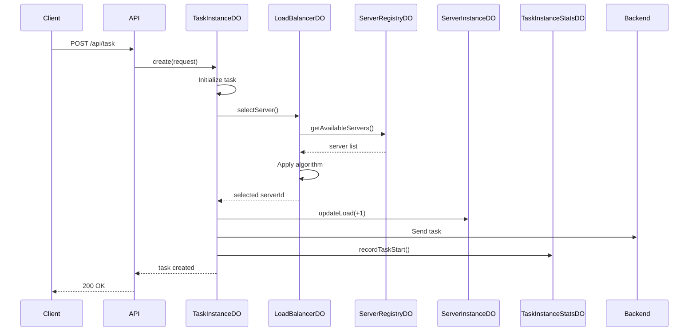
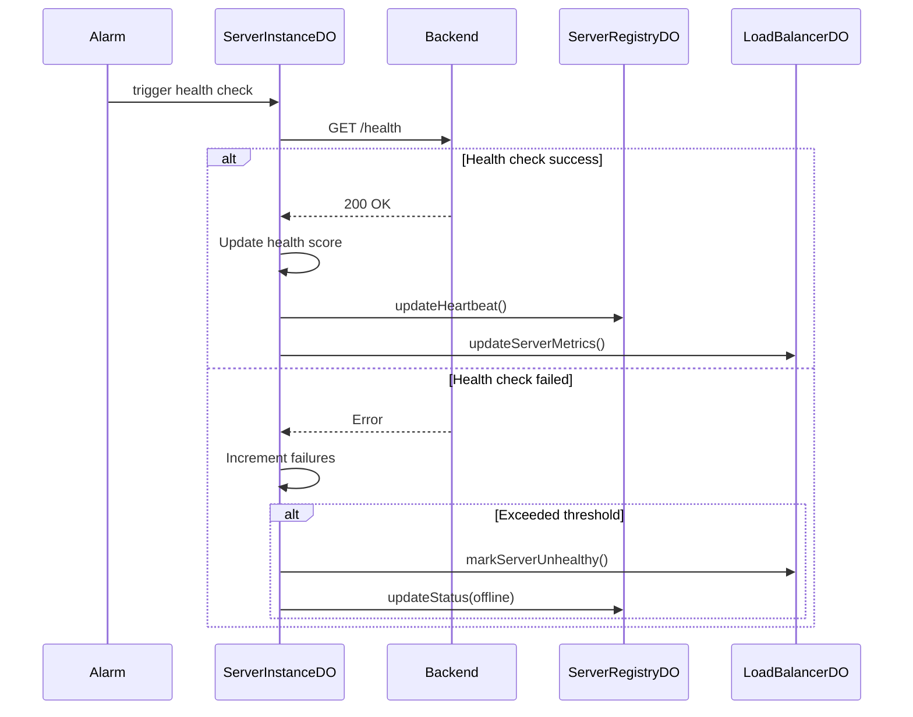
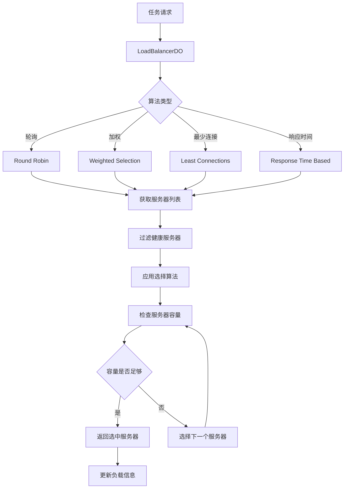

# 新架构设计方案 - 基于Durable Objects的分布式任务处理系统

## 1. 概述

本方案采用更细粒度的Durable Objects设计，将系统功能模块化，提高可扩展性、可维护性和性能。

## 2. Durable Objects 职责定义

### 2.1 TaskInstanceDO (任务实例)
**职责：** 管理单个任务的完整生命周期

**核心功能：**
- 存储任务详细信息（请求、结果、状态）
- 管理任务状态转换（PENDING → QUEUED → PROCESSING → COMPLETED/FAILED）
- 处理任务超时和重试逻辑
- 接收并验证任务更新（来自服务器的回调）
- 持久化任务数据到D1数据库

**数据结构：**
```typescript
interface TaskInstance {
  id: string;
  status: TaskStatus;
  request: TaskRequest;
  result?: TaskResult;
  serverId?: string;
  attempts: number;
  createdAt: number;
  updatedAt: number;
  completedAt?: number;
  error?: string;
}
```

**关键方法：**
- `create(request: TaskRequest): Promise<TaskInstance>`
- `updateStatus(status: TaskStatus, result?: TaskResult): Promise<void>`
- `retry(): Promise<void>`
- `cancel(): Promise<void>`
- `getDetails(): Promise<TaskInstance>`

### 2.2 TaskInstanceStatsDO (任务统计)
**职责：** 聚合和分析任务处理统计数据

**核心功能：**
- 实时统计任务处理指标
- 跟踪任务成功率、失败率、平均处理时间
- 按服务器、时间段、任务类型等维度聚合数据
- 提供性能监控数据
- 生成分析报告

**数据结构：**
```typescript
interface TaskStats {
  totalTasks: number;
  successfulTasks: number;
  failedTasks: number;
  pendingTasks: number;
  processingTasks: number;
  averageProcessingTime: number;
  serverStats: Map<string, ServerTaskStats>;
  hourlyStats: Map<string, HourlyStats>;
}

interface ServerTaskStats {
  serverId: string;
  tasksProcessed: number;
  successRate: number;
  averageResponseTime: number;
  lastActiveTime: number;
}
```

**关键方法：**
- `recordTaskStart(taskId: string, serverId: string): Promise<void>`
- `recordTaskComplete(taskId: string, duration: number, success: boolean): Promise<void>`
- `getStats(timeRange?: TimeRange): Promise<TaskStats>`
- `getServerPerformance(serverId: string): Promise<ServerTaskStats>`
- `getHourlyReport(): Promise<HourlyStats[]>`

### 2.3 LoadBalancerDO (负载均衡器)
**职责：** 智能分配任务到最合适的服务器

**核心功能：**
- 实现多种负载均衡算法（轮询、加权轮询、最少连接、响应时间）
- 根据服务器健康状态和负载情况选择服务器
- 支持服务器亲和性（某些任务偏好特定服务器）
- 动态调整权重基于服务器性能
- 故障转移和自动重试

**数据结构：**
```typescript
interface LoadBalancerConfig {
  algorithm: 'round-robin' | 'weighted' | 'least-connections' | 'response-time';
  healthCheckInterval: number;
  maxRetries: number;
  stickySession: boolean;
}

interface ServerWeight {
  serverId: string;
  weight: number;
  currentLoad: number;
  responseTime: number;
  isHealthy: boolean;
}
```

**关键方法：**
- `selectServer(taskType?: string): Promise<string | null>`
- `updateServerMetrics(serverId: string, metrics: ServerMetrics): Promise<void>`
- `markServerUnhealthy(serverId: string): Promise<void>`
- `rebalance(): Promise<void>`
- `getLoadDistribution(): Promise<Map<string, number>>`

### 2.4 ServerInstanceDO (服务器实例)
**职责：** 管理单个服务器的状态和健康监控

**核心功能：**
- 维护服务器配置和元数据
- 执行定期健康检查
- 跟踪服务器负载和性能指标
- 管理服务器生命周期（上线、下线、维护模式）
- 自适应健康检查频率

**数据结构：**
```typescript
interface ServerInstance {
  id: string;
  name: string;
  endpoints: {
    predict: string;
    health: string;
    metrics?: string;
  };
  status: 'online' | 'offline' | 'maintenance' | 'degraded';
  capabilities: {
    maxConcurrent: number;
    supportedModels: string[];
    async: boolean;
    callback: boolean;
  };
  currentLoad: number;
  healthScore: number; // 0-100
  lastHealthCheck: number;
  consecutiveFailures: number;
}
```

**关键方法：**
- `initialize(config: ServerConfig): Promise<void>`
- `performHealthCheck(): Promise<HealthCheckResult>`
- `updateLoad(delta: number): Promise<void>`
- `setMaintenanceMode(enabled: boolean): Promise<void>`
- `getMetrics(): Promise<ServerMetrics>`
- `shutdown(): Promise<void>`

### 2.5 ServerRegistryDO (服务器注册中心)
**职责：** 中央服务器注册和发现服务

**核心功能：**
- 注册和注销服务器
- 服务发现（查找可用服务器）
- 管理服务器分组和标签
- 协调服务器健康检查
- 发布服务器状态变更事件

**数据结构：**
```typescript
interface ServerRegistry {
  servers: Map<string, ServerMetadata>;
  groups: Map<string, Set<string>>; // groupName -> serverIds
  tags: Map<string, Set<string>>;   // tag -> serverIds
}

interface ServerMetadata {
  id: string;
  instanceId: string; // DurableObjectId
  registeredAt: number;
  lastHeartbeat: number;
  groups: string[];
  tags: string[];
  priority: number;
}
```

**关键方法：**
- `registerServer(config: ServerConfig): Promise<string>`
- `unregisterServer(serverId: string): Promise<void>`
- `getAvailableServers(filter?: ServerFilter): Promise<ServerMetadata[]>`
- `updateHeartbeat(serverId: string): Promise<void>`
- `getServersByGroup(group: string): Promise<ServerMetadata[]>`
- `cleanupStaleServers(maxAge: number): Promise<string[]>`

## 3. 系统交互流程

### 3.1 任务创建流程


### 3.2 健康检查流程


### 3.3 负载均衡决策流程


## 4. 优势分析

### 4.1 职责分离
- 每个DO专注于单一职责，代码更清晰
- 降低耦合度，提高可维护性
- 便于独立测试和调试

### 4.2 性能优化
- **LoadBalancerDO** 实现智能负载均衡，提高资源利用率
- **TaskInstanceStatsDO** 独立处理统计，不影响主业务流程
- 细粒度的DO可以更好地利用Cloudflare的分布式特性

### 4.3 可扩展性
- 新增服务器只需注册到ServerRegistryDO
- 支持多种负载均衡算法，可根据需求切换
- 统计功能独立，可以轻松添加新的分析维度

### 4.4 容错能力
- ServerInstanceDO独立监控每个服务器，快速发现故障
- LoadBalancerDO自动避开不健康的服务器
- 任务级别的重试机制在TaskInstanceDO中实现

### 4.5 可观测性
- TaskInstanceStatsDO提供详细的性能指标
- 每个DO都可以独立监控和调试
- 支持细粒度的日志和追踪

## 5. 实施建议

### 5.1 第一阶段：核心功能
1. 实现TaskInstanceDO - 基础任务管理
2. 实现ServerRegistryDO - 服务器注册
3. 实现ServerInstanceDO - 健康检查
4. 基础API端点

### 5.2 第二阶段：智能调度
1. 实现LoadBalancerDO - 负载均衡
2. 集成负载均衡到任务分配流程
3. 实现多种负载均衡算法

### 5.3 第三阶段：监控分析
1. 实现TaskInstanceStatsDO - 统计分析
2. 添加监控仪表板API
3. 实现告警机制

### 5.4 第四阶段：高级特性
1. 服务器分组和标签
2. 任务优先级队列
3. 自动扩缩容建议
4. A/B测试支持

## 6. 配置示例

```typescript
// wrangler.toml
[[durable_objects.bindings]]
name = "TASK_INSTANCE"
class_name = "TaskInstanceDO"

[[durable_objects.bindings]]
name = "TASK_STATS"
class_name = "TaskInstanceStatsDO"

[[durable_objects.bindings]]
name = "LOAD_BALANCER"
class_name = "LoadBalancerDO"

[[durable_objects.bindings]]
name = "SERVER_INSTANCE"
class_name = "ServerInstanceDO"

[[durable_objects.bindings]]
name = "SERVER_REGISTRY"
class_name = "ServerRegistryDO"
```

## 7. API设计

### 7.1 任务管理
- `POST /api/v2/tasks` - 创建任务
- `GET /api/v2/tasks/:id` - 获取任务详情
- `PUT /api/v2/tasks/:id` - 更新任务
- `DELETE /api/v2/tasks/:id` - 取消任务
- `GET /api/v2/tasks/:id/retry` - 重试任务

### 7.2 服务器管理
- `POST /api/v2/servers` - 注册服务器
- `GET /api/v2/servers` - 列出服务器
- `GET /api/v2/servers/:id` - 服务器详情
- `PUT /api/v2/servers/:id/maintenance` - 维护模式
- `DELETE /api/v2/servers/:id` - 注销服务器

### 7.3 负载均衡
- `GET /api/v2/loadbalancer/status` - 负载状态
- `PUT /api/v2/loadbalancer/config` - 更新配置
- `POST /api/v2/loadbalancer/rebalance` - 手动重平衡

### 7.4 统计分析
- `GET /api/v2/stats/tasks` - 任务统计
- `GET /api/v2/stats/servers` - 服务器统计
- `GET /api/v2/stats/performance` - 性能报告
- `GET /api/v2/stats/hourly` - 小时报告

## 8. 总结

这个新架构通过细粒度的Durable Objects设计，实现了：

1. **更好的关注点分离** - 每个DO有明确的单一职责
2. **更高的性能** - 通过智能负载均衡和独立的统计处理
3. **更强的可扩展性** - 模块化设计便于添加新功能
4. **更好的可观测性** - 独立的统计和监控能力
5. **更强的容错能力** - 多层次的健康检查和故障转移

相比原架构，新方案在复杂度略有增加的情况下，获得了显著的架构优势和运维便利性。